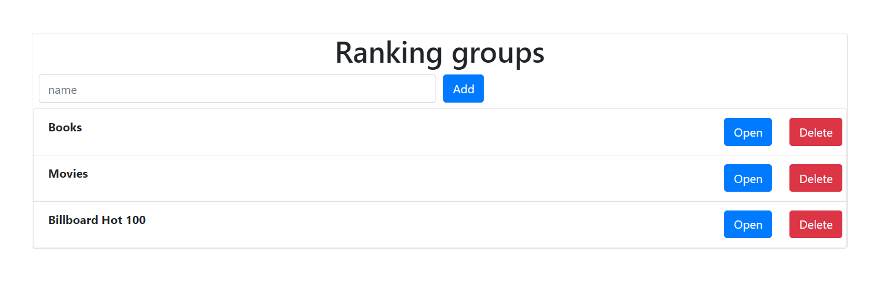
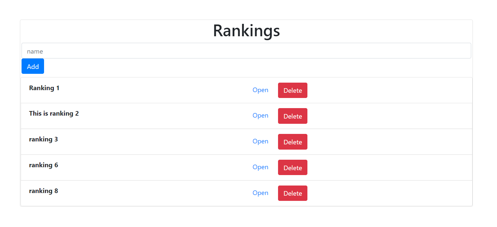
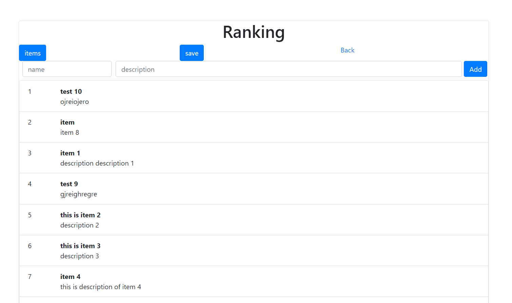
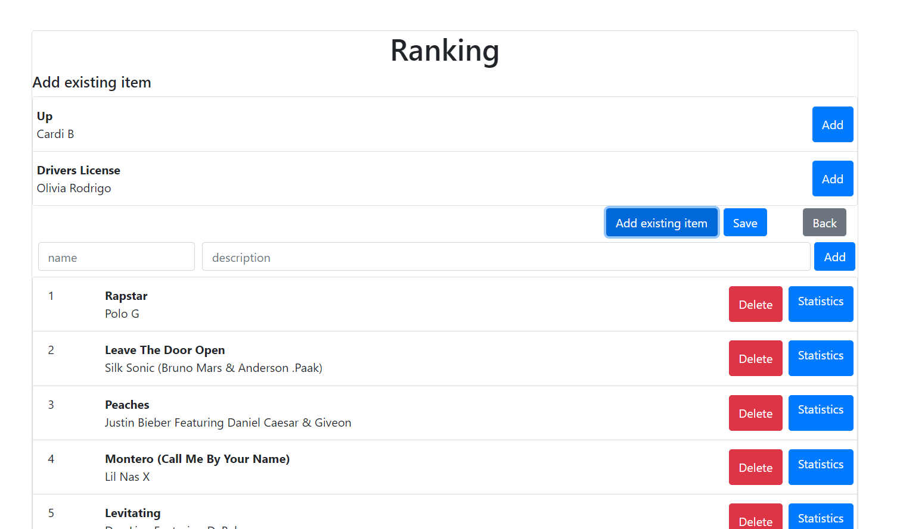

# Ranking Maker
This project is divided into two parts: server and web application. It allows you to create your own rankings and store them in the database.

## Screenshots

  

## Technologies
* React.js
* JSX
* JavaScript
* Spring Boot
* Java
* MySQL

## Features
* Add a new ranking
* Add items to ranking
* Change position of items in ranking
* Save ranking in the database

To-do list:
* Create group of rankings
* Statistics for items
* Delete items

## Status
Project is _in progress_
