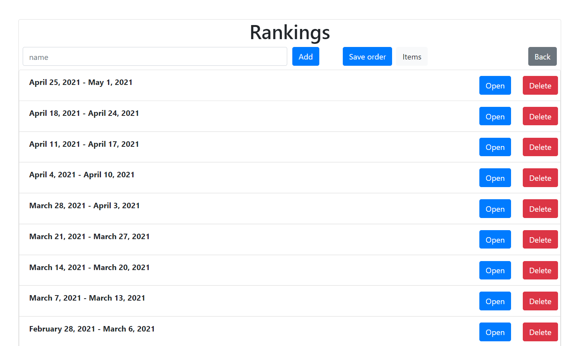
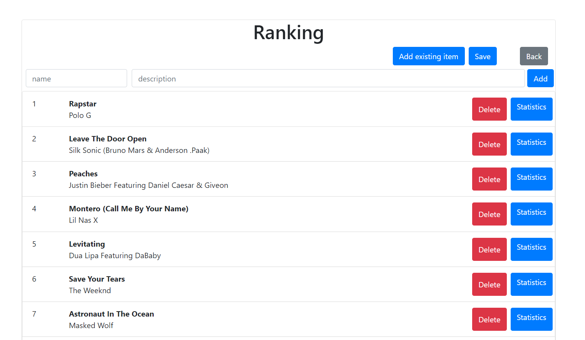

# Ranking Maker
This project is divided into two parts: server and web application. It allows you to create your own rankings and store them in the database. You can create groups of rankings and check statistics for items.

## Screenshots
   

## Technologies
* React.js
* JSX
* JavaScript
* Spring Boot
* Java
* MySQL

## Features
* Create group of rankings
* Add a new ranking
* Add items to ranking
* Change position of items in ranking
* Save ranking in the database
* Statistics for items

To-do list:
* Add renaming items and rankings
* Fix deleting rankings
* More statistics for items
* Improve charts

## Status
Project is _in progress_
